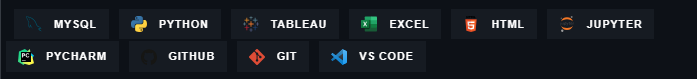

# Hi there, I'm **Robert** 👋   
## I am a dedicated **Data Analyst** with a strong passion for uncovering insights and driving data-informed decision-making. I specialize in leveraging various analytical techniques and tools to extract valuable information from complex datasets.  

* 🔭 I'm working on self projects that can showcase the kind of databases I can build and maintain. As well as analyzing data with various programs and created dashboards. 
* 🌱 I'm currently learning about HTML!
* ❤️ Things I really love doing:
    >> - Coding 💻
    >> - Gaming 🎮
    >> - Running 🏃🏻‍♂️

## Tech Stack 

# Projects
In this repository, you will find a collection of projects that demonstrate my expertise in data analysis. Each project focuses on a specific problem or domain and showcases my ability to extract meaningful insights and present them in a clear and concise manner. Some examples of my work include: 
 - **Movie Analysis**: A project utilizing Python and Beautiful Soup to web scrape movie data from the IMDB website, extract relevant information such as ratings, genres, and cast details. Then transforming and loading the data into an Excel spreadsheet for further analysis.
    
- **Resturant Database**: I developed a comprehensive restaurant database using MySQL and Python. By leveraging the mysql.connector library, I established a seamless connection between Python and MySQL, allowing for efficient data population and retrieval. Furthermore, I delved into sales trends, employing Tableau's powerful visualization capabilities to visualize and interpret the data.

- **NBA Salaries**: Through this analysis of NBA player salaries, I provided valuable insights into the financial landscape of the league during the specified period, offering a deeper understanding of player compensation trends. I merged the power of Excel and Tableau for this project.

# Contact Me  
I am open to collaboration and discussions related to data analysis. If you have any questions, feedback, or project ideas, please feel free to reach out to me. You can contact me via email at robert.lop9@outlook.com or connect with me on LinkedIn.

Thank you for visiting my GitHub repository, and I hope you find my work valuable and insightful. Happy exploring!

<!--
**Robmanpacman/robmanpacman** is a ✨ _special_ ✨ repository because its `README.md` (this file) appears on your GitHub profile.

Here are some ideas to get you started:

- 🔭 I’m currently working on ...
- 🌱 I’m currently learning ...
- 👯 I’m looking to collaborate on ...
- 🤔 I’m looking for help with ...
- 💬 Ask me about ...
- 📫 How to reach me: ...
- 😄 Pronouns: ...
- ⚡ Fun fact: ...
-->
